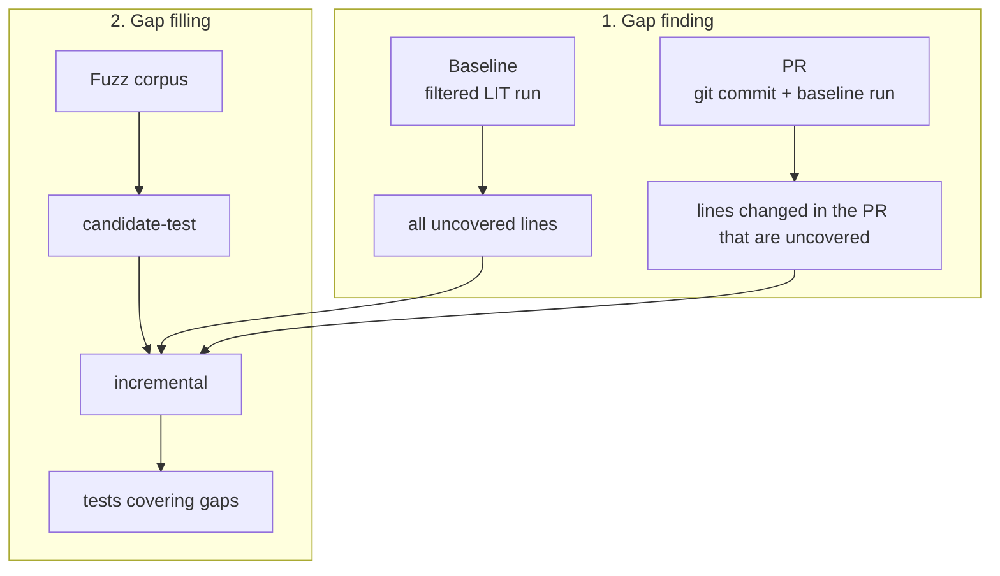

# fuzz-fill

Fuzzing to fill LLVM coverage gaps with fuzz-generated tests.

fuzz-fill has two phases:

1. **Gap finding** — measure baseline coverage achieved by LLVM's LIT test suite and produce a list of uncovered lines. At present `fuzz-fill` supports finding gaps in the AMDGPU and SPIR-V backends; this will be extended in the futuer to other backends and parts of the LLVM codebase.
   - **Baseline** — all uncovered lines in a user-specified part of the LLVM codebase. 
   - **PR** — added or changed lines in a commit that baseline coverage still misses.
2. **Gap filling** — run a fuzz corpus against that list and report which tests cover the gaps; then reduce promising tests into minimal IR modules.



See [Contributions](#contributions) for tests contributed to LLVM.

## Quick start (Docker)

Try [PR gap finding](#gap-finding-pr), which reports lines changed in a PR or commit that are not covered by any LIT tests. Results are saved in `<output-dir>/commit_lines_report/target_lines_uncovered.csv`. See [Gap finding (PR)](#gap-finding-pr) and [Docker test image](#docker-test-image) for more options.

Prerequisites:
- [Docker](https://docs.docker.com/)
- A local `llvm-project` checkout

```bash
git clone https://github.com/ROCm/fuzz-fill.git
cd fuzz-fill
```

**LLVM pull request** — requires [GitHub CLI](https://cli.github.com/) (`gh`). Builds a PR image, squashes all commits onto the PR's base commit, and finds all coverage gaps in that PR:

```bash
./scripts/docker/gap-finding-pr.sh \
  --build-image \
  --llvm-repo /path/to/llvm-project \
  --pr-id 203468 \
  --backend-tests amdgpu \
  --output-dir ./data/gap-finding-pr-203468 \
  -j "$(nproc)"
```

Use `spirv` instead of `amdgpu` for SPIR-V backend tests.

**Local commit** — build from your `llvm-project` checkout (the local checkout remains unchanged). This command only finds gaps in lines changed in a single commit rather than a full PR. Replace `HEAD` with a hash, branch, or `main~3` as needed:

```bash
./scripts/docker/build-image.sh --llvm-dir /path/to/llvm-project --allowlist amdgpu -j "$(nproc)"

./scripts/docker/gap-finding-pr.sh \
  --image fuzz-fill-test:latest \
  --output-dir ./data/my-commit \
  --commit HEAD \
  -j "$(nproc)"
```

To **fill** those gaps with fuzz tests, chain [gap filling](#gap-filling) after gap finding (see [Chaining gap finding and filling](#chaining-gap-finding-and-filling)).

## Table of Contents

- [Quick start (Docker)](#quick-start-docker)
- [Setup](#setup)
  - [Python environment](#python-environment)
  - [LLVM builds](#llvm-builds)
- [Gap finding (baseline)](#gap-finding-baseline)
- [Gap finding (PR)](#gap-finding-pr)
- [Gap filling](#gap-filling)
- [Gap reducing](#gap-reducing)
- [Chaining gap finding, filling, and reducing](#chaining-gap-finding-filling-and-reducing)
- [Reduce interesting tests](#reduce-interesting-tests)
- [CLI reference](#cli-reference)
  - [Uncovered-lines CSV contract](#uncovered-lines-csv-contract)
  - [Environment variables](#environment-variables)
- [Docker test image](#docker-test-image)
  - [Build](#build)
  - [Build from an LLVM pull request](#build-from-an-llvm-pull-request)
  - [PR image build and reuse](#pr-image-build-and-reuse)
  - [Gap finding (baseline) in Docker](#gap-finding-baseline-in-docker)
  - [Gap finding (PR) in Docker](#gap-finding-pr-in-docker)
  - [Gap filling in Docker](#gap-filling-in-docker)
  - [Gap reducing in Docker](#gap-reducing-in-docker)
  - [Run integration tests](#run-integration-tests)
  - [Run a container](#run-a-container)
- [Tests](#tests)
- [Contributions](#contributions)
  - [AMDGPU](#amdgpu)
  - [SPIR-V](#spir-v)

## Setup

### Python environment

```bash
python3 -m venv venv
source venv/bin/activate
pip install -e .
```

### LLVM builds

You need an official **LLVM GitHub release** as bootstrap and one **SanitizerCoverage** build of llvm-project at the matching tag:

| Component | Purpose | How |
|-----------|---------|-----|
| **Release bootstrap** | `clang`, `clang++` for compiling LLVM | Download [LLVM release](https://github.com/llvm/llvm-project/releases) (e.g. `LLVM-22.1.8-Linux-X64.tar.xz`) |
| **SanitizerCoverage** | Unified build tree: instrumented `llc`/`opt`, Release LIT helpers, `llvm-lit`, `sancov` | `./scripts/build-llvm-sancov.sh ./scripts/allowlist-amdgpu.txt llvm-project llvm-project/build-sancov --bootstrap-bin /path/to/LLVM-22.1.8/bin --ignorelist ./scripts/ignorelist-amdgpu.txt` |

`build-llvm-sancov.sh` runs two partial builds from the same source: **`llvm-tblgen` is built from the source tree first**, then a **Release** tree for target-agnostic LIT helpers plus **`sancov`**, and a **Debug** SanitizerCoverage tree for **`llc`**, **`opt`**, and target-linked helpers (`llvm-mc`, `llvm-objdump`, …). Release tools are copied into the instrumented tree's `bin/`; `llvm-lit` is generated there by cmake. The bootstrap release supplies **clang/clang++ only** (TableGen must match the source).

For AMDGPU builds, pass [`scripts/ignorelist-amdgpu.txt`](scripts/ignorelist-amdgpu.txt) with `--ignorelist`. It excludes MC-layer code (AsmParser, Disassembler, MCTargetDesc, MCA, TargetInfo), selected Utils used mainly by MC/PAL/asm, and `AMDGPUSplitModule.cpp` from instrumentation — keeping opt/llc codegen paths covered. SPIRV builds do not use an ignorelist.

**`python -m coverage baseline`** patches **`<instrumented-build>/test/lit.site.cfg.py`** so LIT forwards **`UBSAN_OPTIONS`** to every test subprocess. The patch is idempotent and is re-applied if CMake regenerates that file.

The example scripts below assume paths like:

- `$LLVM/build-sancov/bin` — unified build (`llvm-lit`, instrumented `llc`/`opt` + target helpers, Release `sancov`/other LIT helpers)

Adjust these to match your trees before running.

---

## Gap finding (baseline)

**When to use this:** you want a list of source lines that baseline LIT coverage does not fully hit in a target area (e.g. AMDGPU `CodeGen`).

**Reference script:** [`scripts/gap-finding-baseline.sh`](scripts/gap-finding-baseline.sh)

### What it does

```text
baseline  →  line_coverage_uncovered.csv
(LIT run)     (+ llc_address_line_map.csv)
```

**`coverage baseline`** — identify uncovered lines in run a filtered slice of LLVM instrumented with SanitizerCoverage.

### Configure and run

Edit the variables at the top of [`scripts/gap-finding-baseline.sh`](scripts/gap-finding-baseline.sh):

| Variable | Meaning |
|----------|---------|
| `LLVM_REPO` | Path to your `llvm-project` checkout |
| `LLVM_BIN` | Uninstrumented `bin` directory (`sancov`) |
| `INSTRUMENTED_BIN_DIR` | Instrumented `bin` directory |
| `OUTPUT_DIR` | Root for artifacts |
| `FILTER` | LIT directory prefix (default: `AMDGPU`) |

Then run from the fuzz-fill repo root:

```bash
./scripts/gap-finding-baseline.sh
```

For multiple LIT prefixes and optional inline baseline during gap filling, see [`scripts/gap-filling-amdgpu.sh`](scripts/gap-filling-amdgpu.sh) (`SKIP_BASELINE=0` runs baseline as step 1).

### Key outputs

Under `$OUTPUT_DIR/baseline/`:

| Path | Contents |
|------|----------|
| `line_coverage_summary.csv` | Per-line baseline coverage: `covered`, `partially`, or `uncovered` |
| `line_coverage_uncovered.csv` | **Main gap list** — input to `incremental` and `target-lines` |
| `llc_address_line_map.csv` | LLC address-to-line map — **required** for gap filling |
| `lit_failures.json` | Failed LIT tests (`name`, `code`, `output`, `elapsed`) |
| `processed_sancov/` | Merged symcov (debugging) |

---

## Gap finding (PR)

**When to use this:** you landed a patch and want **added** source lines that baseline coverage still does not fully cover.

**Reference script:** [`scripts/gap-finding-pr.sh`](scripts/gap-finding-pr.sh)

### What it does

```text
added-lines  →  baseline  →  target-lines
(from git)     (LIT run)     (uncovered added lines)
```

1. **`added-lines`** — parse `git show` for a commit and list every line added on the right-hand side of the diff.
2. **`baseline`** — same baseline run as [gap finding (baseline)](#gap-finding-baseline).
3. **`target-lines`** — include each added line whose `(file, line)` appears in `line_coverage_uncovered.csv`.

Step 3 does **not** re-run LIT; you can repeat it with different `added-lines.csv` inputs while baseline artifacts remain valid.

### Configure and run

Edit the variables at the top of [`scripts/gap-finding-pr.sh`](scripts/gap-finding-pr.sh):

| Variable | Meaning |
|----------|---------|
| `LLVM_REPO` | `llvm-project` checkout (same tree `added-lines` diffs against) |
| `LLVM_BIN` / `INSTRUMENTED_BIN_DIR` | Same as baseline gap finding |
| `OUTPUT_DIR` | Root for all artifacts |
| `FILTER` | LIT directory prefix for baseline |
| `COMMIT` | Revision to analyse (`HEAD`, a hash, `main~3`, …) |

Then run:

```bash
./scripts/gap-finding-pr.sh
```

### Key outputs

Under `$OUTPUT_DIR`:

| Path | Contents |
|------|----------|
| `added-lines/added-lines.csv` | Added lines from the commit (`path`, `line_no`, `text`) |
| `baseline/line_coverage_uncovered.csv` | Baseline uncovered lines |
| `baseline/llc_address_line_map.csv` | LLC map — **required** if you gap-fill PR targets |
| `baseline/lit_failures.json` | Failed LIT tests from baseline |
| `commit_lines_report/target_lines_uncovered.csv` | **Main result** — PR-added lines still uncovered (`file`, `line`, optional `text`; absolute paths) |

---

## Gap filling

**When to use this:** you have a gap list from baseline or PR gap finding and want to find fuzz-generated tests that cover those lines.

**Reference script:** [`scripts/gap-filling-amdgpu.sh`](scripts/gap-filling-amdgpu.sh)

### What it does

```text
candidate-test  →  incremental
(fuzz corpus)      (gaps filled)
```

1. **`candidate-test`** — run a directory of fuzz-generated tests (`.ll` / `.bc`) through instrumented `llc` and collect coverage.
2. **`incremental`** — report fuzz tests that fully cover lines in the gap list. A test qualifies only when the line appears in the uncovered-lines CSV passed to `incremental`.

Gap filling stops at `incremental/new_coverage.csv`. Run [gap reducing](#gap-reducing) next to shrink one promising row into a minimal testcase.

The local AMDGPU script can run baseline inline (step 1/3) or reuse an existing gap list (`SKIP_BASELINE=1`). The [Docker gap-filling runner](#gap-filling-in-docker) always requires explicit profile CSV paths.

### Configure and run

```bash
# Full local run (baseline + fill)
./scripts/gap-filling-amdgpu.sh

# Reuse gap list from a prior baseline or PR gap-finding run
SKIP_BASELINE=1 OUTPUT_DIR=./data/my_run ./scripts/gap-filling-amdgpu.sh
```

Environment variables: `OUTPUT_DIR`, `JOBS`, `CORPUS_N`, `TESTS_DIR`, `REFRESH`, `SKIP_BASELINE`, `SKIP_CANDIDATE`, `SKIP_INCREMENTAL`. LIT filters come from [`scripts/lit-filters-amdgpu.sh`](scripts/lit-filters-amdgpu.sh).

When `SKIP_BASELINE=1`, point `OUTPUT_DIR` at a tree that already has `baseline/line_coverage_uncovered.csv` and `baseline/llc_address_line_map.csv` (from baseline gap finding) or copy PR outputs into that layout (`target_lines_uncovered.csv` can replace `line_coverage_uncovered.csv` for `incremental` if you adjust paths in the script or pass CSVs explicitly via the Python CLI).

### Key outputs

Under `$OUTPUT_DIR`:

| Path | Contents |
|------|----------|
| `candidate_tests/raw_sancov/` | Per-test raw sancov shards |
| `incremental/new_coverage.csv` | **Main result** — `test_name`, `file`, `line`, `covered-points` |

---

## Gap reducing

**When to use this:** you have `new_coverage.csv` from gap filling and want to reduce **one row** into a minimal testcase (example / smoke run, not a full batch).

**Reference script:** [`scripts/gap-reducing-amdgpu.sh`](scripts/gap-reducing-amdgpu.sh)

### What it does

```text
new_coverage.csv + candidate_tests/  →  reduce (one row)
                                       →  reduced/t-00001-*/
```

Wraps [`scripts/batch_reduce_using_coverage.py`](scripts/batch_reduce_using_coverage.py) with `--n 1`. Default pipeline: **`llvm_reduce_ir`** only (fast). Append creduce with `WITH_CREDUCE=1` or `--pipeline llvm_reduce_ir,creduce`.

### Configure and run

```bash
# after gap-filling wrote ./data/my_run/incremental/new_coverage.csv
./scripts/gap-reducing-amdgpu.sh --output-dir ./data/my_run

# harness only (no llvm-reduce run)
./scripts/gap-reducing-amdgpu.sh --output-dir ./data/my_run --prepare-only

# second row, with creduce
./scripts/gap-reducing-amdgpu.sh --output-dir ./data/my_run --row 2
WITH_CREDUCE=1 ./scripts/gap-reducing-amdgpu.sh --output-dir ./data/my_run
```

Requires under `--output-dir`:

| Path | Role |
|------|------|
| `incremental/new_coverage.csv` | Input CSV (from gap filling) |
| `candidate_tests/` | Per-test dirs with `test.sh` (from gap filling) |
| `reduced/` | **Output** — one case dir per invocation |

For batch reduction of many rows, use [`scripts/batch_reduce_using_coverage.sh`](scripts/batch_reduce_using_coverage.sh) directly.

---

## Chaining gap finding, filling, and reducing

Typical end-to-end flow:

```text
gap finding (baseline or PR)  →  gap filling  →  reduce
```

**Baseline gaps → fill** (Docker):

```bash
./scripts/docker/gap-finding-baseline.sh --output-dir ./data/baseline-run -j "$(nproc)"

./scripts/docker/gap-filling.sh \
  --output-dir ./data/fill-100 \
  --line-coverage-uncovered-csv ./data/baseline-run/baseline/line_coverage_uncovered.csv \
  --llc-address-line-map-csv ./data/baseline-run/baseline/llc_address_line_map.csv \
  --candidate-tests-dir /path/to/irtests/bitcode/amdgpu/all \
  -n 100 -j "$(nproc)"
```

**PR gaps → fill** (Docker):

```bash
./scripts/docker/gap-finding-pr.sh \
  --pr-id 203468 --output-dir ./data/gap-finding-pr-203468 -j "$(nproc)"

./scripts/docker/gap-filling.sh \
  --pr-id 203468 \
  --output-dir ./data/pr-fill-100 \
  --line-coverage-uncovered-csv ./data/gap-finding-pr-203468/commit_lines_report/target_lines_uncovered.csv \
  --llc-address-line-map-csv ./data/gap-finding-pr-203468/baseline/llc_address_line_map.csv \
  --candidate-tests-dir /path/to/irtests/bitcode/amdgpu/all \
  -n 100 -j "$(nproc)"
```

The LLC map must come from the **same** baseline run (and LIT filters / Docker image) as the uncovered-lines CSV.

**Candidate corpus:** pass an external path such as `irtests/bitcode/amdgpu/all` via `--candidate-tests-dir`. The directory is bind-mounted read-only at run time (not copied into the image). `-n` limits how many tests `candidate-test` processes.

**Image selection:** gap-finding and gap-filling Docker runners accept `--pr-id` (PR LLVM image), `--image` (local or custom tag), or default `fuzz-fill-test:latest`. PR gap finding additionally supports `--build-image` + `--llvm-repo` + `--pr-id`; local commits use `build-image.sh` then `--image fuzz-fill-test:latest --commit <rev>`.

**Reduce one row** after gap filling (same `--output-dir`):

```bash
./scripts/docker/gap-reducing.sh --output-dir ./data/fill-100
./scripts/docker/gap-reducing.sh --bind-repo --output-dir ./data/fill-100 --prepare-only
```

See [Gap reducing in Docker](#gap-reducing-in-docker).

---

## Reduce interesting tests

Once you have `new_coverage.csv` from gap filling, use [gap reducing](#gap-reducing) for a single-row example, or the **`reduce`** module directly for custom configs.

Each row in `new_coverage.csv` maps a test file to a source location and SanitizerCoverage point ids (`covered-points`). Turn a row into a reduction job with a JSON config, `file` / `line`, and an interestingness script that checks the coverage address.

Examples:

- [`example/amd/new-test-1/`](example/amd/new-test-1/) — minimal IR reduction from a coverage row
- [`scripts/reduce_amd_coverage_based.sh`](scripts/reduce_amd_coverage_based.sh), [`scripts/batch_reduce_using_coverage.sh`](scripts/batch_reduce_using_coverage.sh) — batch reduction from a coverage CSV

```bash
python -m reduce --config example/amd/new-test-1/config.json \
  --llc "$LLVM/build-sancov/bin/llc" \
  --llvm-reduce "$LLVM/build-sancov/bin/llvm-reduce"
```

See `python -m reduce --help` and the checked-in `example/*/config.json` files for pipeline options.

---

## CLI reference

The scripts above call these modules. Use `--help` on any command for the full flag list.

| Command | Role |
|---------|------|
| `python -m coverage baseline` | Baseline LIT coverage (gap finding) |
| `python -m coverage candidate-test` | Coverage from a fuzz corpus (gap filling) |
| `python -m coverage incremental` | Match fuzz tests against a gap list (gap filling) |
| `python -m coverage target-lines` | PR added lines vs `line_coverage_uncovered.csv` |
| `python -m added_lines` | Lines added by a git commit |
| `python -m reduce` | Testcase reduction |

### Uncovered-lines CSV contract

`coverage incremental` and PR gap finding both use a baseline uncovered-lines CSV with columns **`file`** and **`line`**. Paths are **absolute** and must match those in `llc_address_line_map.csv` (as produced by `coverage baseline`).

| File | Role |
|------|------|
| `line_coverage_uncovered.csv` | Baseline gap list |
| `target_lines_uncovered.csv` | PR-added lines still uncovered; same `file`/`line` schema, optional `text` |

PR gap finding input to `target-lines` remains `added-lines.csv` (`path`, `line_no`, `text` with git-relative paths). The **output** report uses the shared contract above.

`coverage incremental` requires explicit CSV paths:

```bash
python -m coverage incremental \
  --output-dir data/incremental \
  --line-coverage-uncovered-csv data/baseline/line_coverage_uncovered.csv \
  --llc-address-line-map-csv data/baseline/llc_address_line_map.csv \
  --candidate-tests-output-dir data/candidate_tests
```

For PR targets, pass `target_lines_uncovered.csv` as `--line-coverage-uncovered-csv` instead.

### `coverage baseline` filters

| Flag | Meaning |
|------|---------|
| `--lit-filter DIR` | LIT directory prefix; **repeat** for multiple prefixes (OR'd into one llvm-lit `--filter=` regex) |

Default when omitted: `AMDGPU` (see `DEFAULT_LIT_FILTER_DIRS` in [`src/coverage/constants.py`](src/coverage/constants.py)).

Baseline symcov CSVs always include source paths under `llvm/lib` (see `DEFAULT_SOURCE_CODE_FILTER` in [`src/coverage/constants.py`](src/coverage/constants.py)).

### Environment variables

Several commands accept LLVM tool paths via environment variables when the matching CLI flag is omitted. A flag on the command line always wins.

| Env var | CLI flag | Commands |
|---------|----------|----------|
| `FUZZ_FILL_SANCOV` | `--sancov` | `coverage baseline`, `coverage incremental` |
| `FUZZ_FILL_LLVM_LIT` | `--llvm-lit` | `coverage baseline` |
| `FUZZ_FILL_LLC` | `--llc` | `coverage baseline`, `coverage candidate-test`, `reduce` |
| `FUZZ_FILL_OPT` | `--opt` | `coverage baseline` |
| `FUZZ_FILL_LLVM_REDUCE` | `--llvm-reduce` | `reduce` |
| `FUZZ_FILL_LLVM_DIS` | `--llvm-dis` | `reduce` (required for `.bc` input with `llvm_reduce_ir`) |
| `FUZZ_FILL_LLVM_REPO` | `--llvm-repo` | `added_lines`, `coverage target-lines` |

The [Docker test image](#docker-test-image) sets these per-tool defaults so interactive container use can omit tool flags. Integration tests use explicit CLI flags instead (see [Integration tests](#integration-tests)).

Example (paths match the Docker test image):

```bash
export FUZZ_FILL_SANCOV=/work/llvm-build-sancov/bin/sancov
export FUZZ_FILL_LLVM_LIT=/work/llvm-build-sancov/bin/llvm-lit
export FUZZ_FILL_LLC=/work/llvm-build-sancov/bin/llc
export FUZZ_FILL_OPT=/work/llvm-build-sancov/bin/opt
export FUZZ_FILL_LLVM_REPO=/work/llvm-project

python -m coverage baseline --output-dir data/baseline
python -m added_lines --commit HEAD
```

CodeGen-only baseline:

```bash
python -m coverage baseline \
  --output-dir data/baseline-codegen \
  --lit-filter CodeGen/AMDGPU
```

Or via the reference script:

```bash
FILTER=CodeGen/AMDGPU ./scripts/gap-finding-baseline.sh
```

Workflow shell scripts under `scripts/` may use their own names (`LLVM_BIN`, `INSTRUMENTED_BIN_DIR`, …); only the `FUZZ_FILL_*` variables are read by the Python CLIs.

---

## Docker test image

The Docker image bundles an official LLVM release bootstrap, a dual-build SanitizerCoverage LLVM tree (instrumented `llc`/`opt` plus Release helpers), and a fuzz-fill venv. Use it when you want to run integration tests or experiment without building LLVM locally.

**Scripts** (under [`scripts/docker/`](scripts/docker/)): [`build-image.sh`](scripts/docker/build-image.sh), [`build-image-pr.sh`](scripts/docker/build-image-pr.sh), [`ensure-image.sh`](scripts/docker/ensure-image.sh), [`gap-finding-baseline.sh`](scripts/docker/gap-finding-baseline.sh), [`gap-finding-pr.sh`](scripts/docker/gap-finding-pr.sh), [`gap-filling.sh`](scripts/docker/gap-filling.sh), [`gap-reducing.sh`](scripts/docker/gap-reducing.sh), [`test-image.sh`](scripts/docker/test-image.sh), [`tmp-container.sh`](scripts/docker/tmp-container.sh)

The image bakes a copy of fuzz-fill at `/work/fuzz-fill` when built. Pass **`--bind-repo`** on a docker runner to mount your local checkout over that path (venv stays at `/work/fuzz-fill-venv`) when you need code that is newer than the image.

### Build

From the repo root (first build compiles LLVM and can take a while):

```bash
./scripts/docker/build-image.sh
```

By default the image is tagged `fuzz-fill-test:latest`. LLVM source is downloaded at tag `llvmorg-22.1.8` and bootstrapped from the matching GitHub release.

| Option | Meaning |
|--------|---------|
| `--llvm-dir <path>` | Use a local `llvm-project` checkout instead of downloading tagged source |
| `--llvm-release-version <ver>` | Official LLVM release for bootstrap toolchain (default: `22.1.8`) |
| `--tag <tag>` | Docker image tag (default: `latest`) |
| `--allowlist amdgpu\|spirv` | SanitizerCoverage allowlist baked into the instrumented build (default: `amdgpu`; AMDGPU also applies [`scripts/ignorelist-amdgpu.txt`](scripts/ignorelist-amdgpu.txt)) |
| `-j <n>`, `--jobs <n>` | Limit ninja parallelism for the sancov build (default: unconstrained) |

Examples:

```bash
./scripts/docker/build-image.sh --llvm-dir llvm-project --tag local-llvm
./scripts/docker/build-image.sh --allowlist spirv --tag spirv
./scripts/docker/build-image.sh -j "$(nproc)"
```

Use this image with **`--image fuzz-fill-test:latest`** for local-commit gap finding (see [Quick start](#quick-start-docker)).

### Build from an LLVM pull request

[`scripts/docker/build-image-pr.sh`](scripts/docker/build-image-pr.sh) builds a Docker image from an LLVM PR. Pass a local `llvm-project` clone; the PR is squashed in a standalone fuzz-fill clone so your llvm checkout is unchanged. Requires local `gh` and Docker (BuildKit). PRs are assumed to live on **`llvm/llvm-project`** unless you pass `--github-repo`.

```bash
./scripts/docker/build-image-pr.sh --llvm-repo /path/llvm-project --pr-id 185430 --allowlist amdgpu
```

| Option | Meaning |
|--------|---------|
| `--llvm-repo <path>` | Local `llvm-project` clone |
| `--pr-id <n>` | GitHub pull request number |
| `--allowlist amdgpu\|spirv` | SanitizerCoverage allowlist |
| `--github-repo <owner/repo>` | GitHub repo hosting the PR (default: `llvm/llvm-project`) |
| `-j <n>`, `--jobs <n>` | Limit ninja parallelism for both LLVM builds (default: unconstrained) |

For build + gap finding in one step, use [`gap-finding-pr.sh --build-image`](#gap-finding-pr-in-docker) instead.

### PR image build and reuse

Gap-finding and gap-filling Docker runners share [`ensure-image.sh`](scripts/docker/ensure-image.sh) for PR images tagged `fuzz-fill-test:llvm-pr-<n>`:

| Flag | Meaning |
|------|---------|
| `--build-image` | Build via `build-image-pr.sh` when the tag is missing |
| `--force-build` | Rebuild even when the tag already exists |
| `--keep-image` | Do not remove the image after a `--build-image` run (default: remove) |
| `--pr-id <n>` | Select `fuzz-fill-test:llvm-pr-<n>` |
| `--llvm-repo <path>` | Required with `--build-image` |
| `--backend-tests amdgpu\|spirv` | Required with `--build-image` |

Build once, then reuse on later runs (omit `--build-image`):

```bash
./scripts/docker/gap-finding-pr.sh \
  --build-image --keep-image \
  --llvm-repo /path/llvm-project --pr-id 203468 \
  --backend-tests amdgpu --output-dir ./data/gap-finding-pr-203468 -j "$(nproc)"

./scripts/docker/gap-finding-pr.sh \
  --pr-id 203468 --output-dir ./data/gap-finding-pr-203468
```

### Gap finding (baseline) in Docker

[`scripts/docker/gap-finding-baseline.sh`](scripts/docker/gap-finding-baseline.sh) runs `coverage baseline` in a container. Output: `<output-dir>/baseline/`.

```bash
./scripts/docker/gap-finding-baseline.sh \
  --output-dir ./data/baseline-run \
  -j "$(nproc)"
```

| Option | Meaning |
|--------|---------|
| `--output-dir <path>` | Host output directory (required) |
| `--image <ref>` | Docker image (default: `fuzz-fill-test:latest`) |
| `--pr-id <n>` | PR image `fuzz-fill-test:llvm-pr-<n>` |
| `--build-image` | Build PR image when missing (see [PR image build and reuse](#pr-image-build-and-reuse)) |
| `--bind-repo` | Mount local fuzz-fill checkout over `/work/fuzz-fill` |
| `--lit-filter <prefix>` | LIT filter override (default: from image `/work/.sancov-allowlist`) |
| `-j <n>`, `--jobs <n>` | Parallel jobs for llvm-lit and ninja (when building) |

### Gap finding (PR) in Docker

[`scripts/docker/gap-finding-pr.sh`](scripts/docker/gap-finding-pr.sh) runs baseline → `added_lines` → `target-lines`. Requires **`--image` or `--pr-id`**.

**GitHub PR** (build + run):

```bash
./scripts/docker/gap-finding-pr.sh \
  --build-image \
  --llvm-repo /path/llvm-project \
  --pr-id 203468 \
  --backend-tests amdgpu \
  --output-dir ./data/gap-finding-pr-203468 \
  -j "$(nproc)"
```

**Local commit** (after [`build-image.sh`](#build)):

```bash
./scripts/docker/gap-finding-pr.sh \
  --image fuzz-fill-test:latest \
  --output-dir ./data/my-commit \
  --commit HEAD \
  -j "$(nproc)"
```

For AMDGPU images, baseline defaults to the twelve LIT prefixes in [`scripts/lit-filters-amdgpu.sh`](scripts/lit-filters-amdgpu.sh) (same as [`scripts/gap-filling-amdgpu.sh`](scripts/gap-filling-amdgpu.sh)); SPIRV defaults to `CodeGen/SPIRV`. Override with one or more `--lit-filter` prefixes.

| Option | Meaning |
|--------|---------|
| `--image <ref>` | Docker image (required unless `--pr-id`) |
| `--pr-id <n>` | PR image tag `llvm-pr-<n>` (required unless `--image`) |
| `--commit <rev>` | Revision for `added_lines` (default: `HEAD` in container llvm-project) |
| `--build-image` | Build PR image when missing |
| `--force-build` / `--keep-image` | Rebuild or retain PR image |
| `--llvm-repo <path>` | Required with `--build-image` |
| `--backend-tests amdgpu\|spirv` | Required with `--build-image` |
| `--output-dir <path>` | Host output directory |
| `-j <n>`, `--jobs <n>` | Parallel jobs |
| `--lit-filter <dir>` | LIT prefix; repeat for multiple |
| `--github-repo <owner/repo>` | When building (default: `llvm/llvm-project`) |

Main output: `<output-dir>/commit_lines_report/target_lines_uncovered.csv`.

### Gap filling in Docker

[`scripts/docker/gap-filling.sh`](scripts/docker/gap-filling.sh) runs `candidate-test` → `incremental`.

**Candidate tests are not baked into the image.** By default, `--candidate-tests-dir` is bind-mounted read-only from the host (e.g. an external `irtests` corpus). No host-side copy is made; `-n` limits how many `.ll`/`.bc` files `candidate-test` processes (sorted path order). Pass **`--stage-candidate-tests`** to copy the first N inputs into a temp dir before mounting instead (previous behaviour).

**Requires** both profile CSV flags (gap list + LLC map from the same baseline run):

```bash
./scripts/docker/gap-filling.sh \
  --output-dir ./data/fill-100 \
  --line-coverage-uncovered-csv ./data/baseline-run/baseline/line_coverage_uncovered.csv \
  --llc-address-line-map-csv ./data/baseline-run/baseline/llc_address_line_map.csv \
  --candidate-tests-dir /path/to/irtests/bitcode/amdgpu/all \
  -n 100 \
  -j "$(nproc)"
```

PR gap list (use `target_lines_uncovered.csv` as the uncovered-lines CSV):

```bash
./scripts/docker/gap-filling.sh \
  --pr-id 203468 \
  --output-dir ./data/pr-fill-100 \
  --line-coverage-uncovered-csv ./data/gap-finding-pr-203468/commit_lines_report/target_lines_uncovered.csv \
  --llc-address-line-map-csv ./data/gap-finding-pr-203468/baseline/llc_address_line_map.csv \
  --candidate-tests-dir /path/to/irtests/bitcode/amdgpu/all \
  -n 100 -j "$(nproc)"
```

| Option | Meaning |
|--------|---------|
| `--output-dir <path>` | Host output directory (required) |
| `--line-coverage-uncovered-csv <path>` | Gap list CSV (required) |
| `--llc-address-line-map-csv <path>` | LLC map from same baseline (required) |
| `--candidate-tests-dir <path>` | Host corpus root, bind-mounted read-only (required) |
| `-n <N>`, `--n <N>` | First N candidate tests to run (required) |
| `--stage-candidate-tests` | Copy first N inputs to a temp dir before mounting (default: bind-mount full dir) |
| `--image <ref>` / `--pr-id <n>` | Docker image |
| `--build-image` | Build PR image when missing |
| `--bind-repo` | Mount local fuzz-fill checkout |
| `-j <n>`, `--jobs <n>` | Parallel jobs |

Main output: `<output-dir>/incremental/new_coverage.csv`.

### Gap reducing in Docker

[`scripts/docker/gap-reducing.sh`](scripts/docker/gap-reducing.sh) reduces **one row** from a prior gap-filling run. Mounts `--output-dir` at `/mounted-output/` (must already contain `incremental/new_coverage.csv` and `candidate_tests/`).

```bash
./scripts/docker/gap-reducing.sh --output-dir ./data/fill-100
./scripts/docker/gap-reducing.sh --pr-id 203468 --output-dir ./data/fill-100 --row 1
./scripts/docker/gap-reducing.sh --bind-repo --output-dir ./data/fill-100 --prepare-only
```

| Option | Meaning |
|--------|---------|
| `--output-dir <path>` | Gap-fill output directory (required) |
| `--row <n>` | CSV row to reduce (default: 1) |
| `--prepare-only` | Create harness under `reduced/` without running reduce |
| `--pipeline <ids>` | Reduce pipeline (default: `llvm_reduce_ir`) |
| `--with-creduce` | Append creduce to the pipeline |
| `--image <ref>` / `--pr-id <n>` | Docker image (same as gap filling) |
| `--bind-repo` | Mount local fuzz-fill checkout |

Default pipeline is `llvm_reduce_ir` only (no creduce). The image includes `llvm-reduce` and `creduce` ([`Dockerfile`](Dockerfile)).

Main output: `<output-dir>/reduced/t-00001-*/` (case harness; reduced artifacts under `reduced/` inside that dir when not using `--prepare-only`).

### Run integration tests

```bash
./scripts/docker/test-image.sh
```

This runs the full suite under `integration-tests/` using the image baked into the container. Pass the same `--tag` you used when building:

```bash
./scripts/docker/build-image.sh --tag local-llvm
./scripts/docker/test-image.sh --tag local-llvm
```

After building a [PR image](#build-from-an-llvm-pull-request), pass the same tag (default `llvm-pr-<pr-id>`):

```bash
./scripts/docker/build-image-pr.sh --llvm-repo ../llvm-project --pr-id 185430 --allowlist amdgpu
./scripts/docker/test-image.sh --tag llvm-pr-185430
```

Use `--bind-repo` to mount your local fuzz-fill checkout over `/work/fuzz-fill` while keeping the image venv at `/work/fuzz-fill-venv`:

```bash
./scripts/docker/test-image.sh --bind-repo
```

Any extra arguments are forwarded to lit. For example:

```bash
./scripts/docker/test-image.sh --tag local-llvm integration-tests/smoke.test
```

### Run a container

For an interactive shell or arbitrary commands:

```bash
./scripts/docker/tmp-container.sh                              # interactive shell
./scripts/docker/tmp-container.sh --bind-repo                  # shell with host repo mounted
./scripts/docker/tmp-container.sh --bind-repo <command> [args] # one-shot command
```

Without `--bind-repo`, the container uses the fuzz-fill copy baked into the image.

With `--bind-repo`, your local checkout is mounted at `/work/fuzz-fill`; the venv stays at `/work/fuzz-fill-venv`.

To run integration tests manually inside the container:

```bash
./scripts/docker/tmp-container.sh ./integration-tests/test.sh \
  --venv /work/fuzz-fill-venv \
  --llvm-build /work/llvm-build-sancov/bin \
  --llvm-sancov-build /work/llvm-build-sancov/bin \
  --llvm-src /work/llvm-project \
  -v integration-tests/
```

---

## Tests

### Unit tests

Python unit tests live under `tests/`. They use the stdlib `unittest` runner and do not need LLVM builds.

```bash
source venv/bin/activate
python -m unittest discover -s tests -v
```

To run a single module:

```bash
python -m unittest tests.test_analyser -v
```

### Integration tests

Integration tests need the SanitizerCoverage LLVM `bin` directory and llvm-project source. Locally:

```bash
./integration-tests/test.sh \
  --venv ./venv/ \
  --llvm-build llvm-project/build-sancov/bin/ \
  --llvm-sancov-build llvm-project/build-sancov/bin/ \
  --llvm-src llvm-project/ \
  integration-tests/
```

Or use [`scripts/docker/test-image.sh`](scripts/docker/test-image.sh) with the [Docker test image](#docker-test-image). That script runs unit tests first, then integration tests:

```bash
./scripts/docker/test-image.sh                    # default tag: latest
./scripts/docker/test-image.sh --tag llvm-pr-42   # after scripts/docker/build-image-pr.sh
./scripts/docker/test-image.sh --bind-repo        # mount local checkout
```

Both `--llvm-build` and `--llvm-sancov-build` point at the same SanitizerCoverage tree; `--llvm-src` is the llvm-project checkout root (used as `%llvm-repo` in tests).

---

## Contributions

### AMDGPU

| Date | Commit | Summary |
|------|--------|---------|
| 2026-03-10 | [30f13b12a0be](https://github.com/llvm/llvm-project/commit/30f13b12a0bee2ec109f37876d3d17106acfb41f) | New `vgpr-mark-last-scratch-load.ll` coverage for `AMDGPUMarkLastScratchLoad` ([#185430](https://github.com/llvm/llvm-project/pull/185430)) |
| 2026-03-19 | [c63ce62f7cf6](https://github.com/llvm/llvm-project/commit/c63ce62f7cf6193714e95f6b3442170ccb2a3a5e) | New cases in `si-lower-i1-copies.mir` for `SILowerI1Copies` ([#186127](https://github.com/llvm/llvm-project/pull/186127)) |
| 2026-03-31 | [67d4842910b8](https://github.com/llvm/llvm-project/commit/67d4842910b8cb79f31b9041bdf56c206cd768e9) | New cases in `si-lower-sgpr-spills.mir` for `SILowerSGPRSpills` ([#189426](https://github.com/llvm/llvm-project/pull/189426)) |
| 2026-06-12 | [4a3946fc690c](https://github.com/llvm/llvm-project/commit/4a3946fc690c461417d38b6264a1f7a70f5dd364) | Expanded `float-sopc-vopc.ll` coverage for `SIInstrInfo` ([#200414](https://github.com/llvm/llvm-project/pull/200414)) |

### SPIR-V

| Date | Commit | Summary |
|------|--------|---------|
| 2026-03-11 | [e45c8b6555c8](https://github.com/llvm/llvm-project/commit/e45c8b6555c866cd0412b42fce0439e927ca3ba2) | New `icmp.ll` cases for the SPIR-V backend ([#185686](https://github.com/llvm/llvm-project/pull/185686)) |
| 2026-03-17 | [b2442a20a946](https://github.com/llvm/llvm-project/commit/b2442a20a9462ef4a4244c2992abf6a102e90472) | New `icmp.ll` cases for `SPIRVInstructionSelector` ([#186069](https://github.com/llvm/llvm-project/pull/186069)) |
| 2026-03-25 | [741eb8015253](https://github.com/llvm/llvm-project/commit/741eb8015253866323a3c38eb4e7ae686323002d) | New `SPIRVEmitIntrinsics.ll` for the `SPIRVEmitIntrinsics` pass ([#188285](https://github.com/llvm/llvm-project/pull/188285)) |
| 2026-03-27 | [294dc1b89452](https://github.com/llvm/llvm-project/commit/294dc1b894520506cdd8d260f51c3f8fec6a7118) | New `SPIRVEmitIntrinsics-get-element-ptr.ll` ([#188962](https://github.com/llvm/llvm-project/pull/188962)) |
| 2026-03-27 | [9238b0f765ad](https://github.com/llvm/llvm-project/commit/9238b0f765ada177cd7034cf75a57acf26f2ac46) | New `SPIRVEmitIntrinsics-infer-ptr-type.ll` ([#188950](https://github.com/llvm/llvm-project/pull/188950)) |
| 2026-03-31 | [a839e500e8a1](https://github.com/llvm/llvm-project/commit/a839e500e8a1934d3ad0a346d3789904c2a865a9) | New `SPIRVEmitIntrinsics-infer-fnptr-todo-type.ll` ([#189413](https://github.com/llvm/llvm-project/pull/189413)) |
